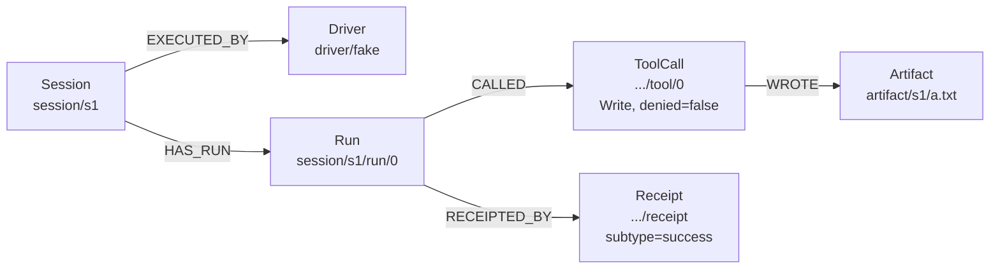

# Graph model

The session graph is a projection of the append-only event log. It is not
the source of truth — the log is. The graph can be dropped and rebuilt from
the log at any time (`SessionGraph.rebuild(events)`), and rebuilding is
deterministic: replaying the same events twice produces an identical
snapshot (`packages/core/test/graph.test.ts`).

## Node types

| Type | ID pattern | Created by event | Props |
|---|---|---|---|
| `Session` | `session/<id>` | `session.created` | `created_at`; `cancelled_at` if cancelled |
| `Run` | `session/<id>/run/<n>` | `run.started` | `prompt`, `started_at` |
| `Message` | `session/<id>/run/<n>/msg/<i>` | `message` | `role`, `text` |
| `ToolCall` | `session/<id>/run/<n>/tool/<i>` | `tool.called` or `tool.denied` | `name`, `input`, `denied`, `reason` |
| `Artifact` | `artifact/<session_id>/<path>` | `artifact.written` | `path` |
| `ContextInjection` | `session/<id>/context/<i>` | `context.injected` | `text` |
| `Driver` | `driver/<name>` | `session.created` | (none) |
| `Workspace` | `workspace/<session_id>` | `session.created` | `path` |
| `Receipt` | `session/<id>/run/<n>/receipt` | `run.finished` | all `run.finished` data (`subtype`, `num_turns`, `duration_ms`, `cost_usd`, or `error` for failed runs), `finished_at` |

## Edge types

Every edge carries provenance: `{ ts, source_event_id }`, taken from the
event that produced it. Edges are otherwise `(from, to, type)`; the primary
key is `(from, to, type, source_event_id)`, so replaying the same event
twice does not duplicate an edge.

| Type | From → To | Meaning |
|---|---|---|
| `HAS_RUN` | `Session` → `Run` | session owns this run |
| `PRODUCED` | `Session` → `Workspace`, or `Run` → `Message` | creation |
| `CALLED` | `Run` → `ToolCall` | run invoked this tool (allowed or denied) |
| `WROTE` | `ToolCall` (or `Run`) → `Artifact` | see note below |
| `INJECTED_INTO` | `ContextInjection` → `Session` | context was added to a session |
| `RESUMED_FROM` | `Run` → `Run` | a run resumed an earlier run's harness session |
| `EXECUTED_BY` | `Session` → `Driver` | which driver backend ran this session |
| `RECEIPTED_BY` | `Run` → `Receipt` | run finished, with terminal outcome |

### `WROTE` source note

The spec originally described `WROTE` as `Run → Artifact`. The implementation
(`packages/core/src/graph.ts`) is more precise: it tracks the most recently
seen `ToolCall` node for each run and draws `WROTE` from *that tool call* to
the `Artifact`, falling back to the `Run` node only if no tool call has been
recorded yet for that run. This means the graph can answer "which specific
tool call wrote this file", not just "which run".

## ID conventions

Node IDs are stable, position-addressed paths, not opaque keys:

- `session/<uuid>` — session id is a full UUID (`crypto.randomUUID()`).
- `session/<id>/run/<n>` — `n` is a zero-based run counter, incremented per
  session on each `SessionManager.run()` call.
- `session/<id>/run/<n>/tool/<i>` and `.../msg/<i>` — `i` is a zero-based
  index within that run, assigned in emission order.
- `artifact/<session_id>/<path>` — `path` is the artifact's path relative to
  the session workspace, as reported by the driver.
- `driver/<name>` and `workspace/<session_id>` — one node per session for
  the driver backend and the workspace directory.

IDs double as edge endpoints and as the unit of upsert (`INSERT OR REPLACE`
on `nodes`), so re-applying an event for a node that already exists
overwrites its props rather than creating a duplicate.

## Rebuild guarantee

`SessionManager` always rebuilds the graph from the on-disk event log at
construction time (`this.graph.rebuild(this.log.readAll())`), before
accepting new work. The graph database itself is disposable: delete
`graph.db` and it is reconstructed exactly from `events.jsonl` on next
start. `graph.test.ts` asserts this directly: replaying the same event list
twice into a fresh graph, and replaying it twice into the same graph
instance, produce identical `snapshot()` output.

## Worked example

This is the fixture from `packages/core/test/graph.test.ts`: a session
running the `fake` driver, one run that calls `Write` and produces an
artifact, then finishes successfully.

Five events produce this graph:

1. `session.created` → `Session` node, `Driver` node, `EXECUTED_BY` edge.
2. `run.started` → `Run` node, `HAS_RUN` edge.
3. `tool.called` (`Write`) → `ToolCall` node, `CALLED` edge; remembered as
   the run's last tool call.
4. `artifact.written` → `Artifact` node; `WROTE` edge from the remembered
   `ToolCall`, not from `Run`.
5. `run.finished` → `Receipt` node, `RECEIPTED_BY` edge.
